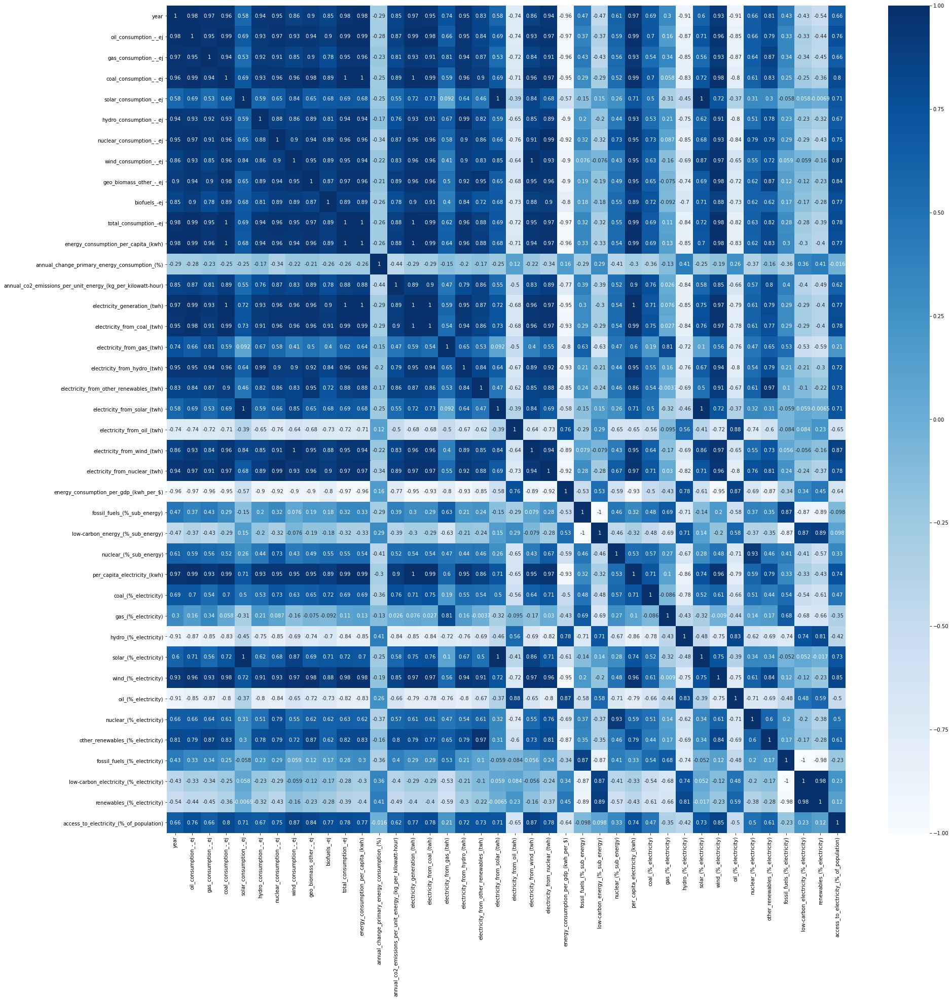

```python
# Indian Energy Consumption over the Years-- An Exploratory Data Analysis
```


```python
import numpy as np
import pandas as pd
import matplotlib.pyplot as plt
%matplotlib inline
import seaborn as sns
import statsmodels.api as sm
```


```python
## Reading the data

energy=pd.read_csv("energy.csv")
```


```python
## Exploratory Data Analysis
energy.head()
```


<div>
<style scoped>
    .dataframe tbody tr th:only-of-type {
        vertical-align: middle;
    }

    .dataframe tbody tr th {
        vertical-align: top;
    }

    .dataframe thead th {
        text-align: right;
    }
</style>
<table border="1" class="dataframe">
  <thead>
    <tr style="text-align: right;">
      <th></th>
      <th>Year</th>
      <th>Oil Consumption - EJ</th>
      <th>Gas Consumption - EJ</th>
      <th>Coal Consumption - EJ</th>
      <th>Solar Consumption - EJ</th>
      <th>Hydro Consumption - EJ</th>
      <th>Nuclear Consumption - EJ</th>
      <th>Wind Consumption - EJ</th>
      <th>Geo Biomass Other - EJ</th>
      <th>Biofuels -EJ</th>
      <th>...</th>
      <th>Hydro (% electricity)</th>
      <th>Solar (% electricity)</th>
      <th>Wind (% electricity)</th>
      <th>Oil (% electricity)</th>
      <th>Nuclear (% electricity)</th>
      <th>Other renewables (% electricity)</th>
      <th>Fossil fuels (% electricity)</th>
      <th>Low-carbon electricity (% electricity)</th>
      <th>Renewables (% electricity)</th>
      <th>Access to electricity (% of population)</th>
    </tr>
  </thead>
  <tbody>
    <tr>
      <th>0</th>
      <td>1985</td>
      <td>517.636209</td>
      <td>43.228316</td>
      <td>857.397765</td>
      <td>0.0</td>
      <td>143.925242</td>
      <td>12.521643</td>
      <td>0.0</td>
      <td>0.0</td>
      <td>0.0</td>
      <td>...</td>
      <td>27.798811</td>
      <td>0.0</td>
      <td>0.0</td>
      <td>6.367437</td>
      <td>2.418525</td>
      <td>0.0</td>
      <td>69.782664</td>
      <td>30.217336</td>
      <td>27.798811</td>
      <td>NaN</td>
    </tr>
    <tr>
      <th>1</th>
      <td>1986</td>
      <td>544.259897</td>
      <td>60.400292</td>
      <td>921.240791</td>
      <td>0.0</td>
      <td>146.024459</td>
      <td>13.945673</td>
      <td>0.0</td>
      <td>0.0</td>
      <td>0.0</td>
      <td>...</td>
      <td>25.937186</td>
      <td>0.0</td>
      <td>0.0</td>
      <td>5.676021</td>
      <td>2.477061</td>
      <td>0.0</td>
      <td>71.585753</td>
      <td>28.414247</td>
      <td>25.937186</td>
      <td>NaN</td>
    </tr>
    <tr>
      <th>2</th>
      <td>1987</td>
      <td>561.767229</td>
      <td>69.577063</td>
      <td>1011.630644</td>
      <td>0.0</td>
      <td>136.007144</td>
      <td>14.780450</td>
      <td>0.0</td>
      <td>0.0</td>
      <td>0.0</td>
      <td>...</td>
      <td>21.890573</td>
      <td>0.0</td>
      <td>0.0</td>
      <td>5.521987</td>
      <td>2.378938</td>
      <td>0.0</td>
      <td>75.730490</td>
      <td>24.269510</td>
      <td>21.890573</td>
      <td>NaN</td>
    </tr>
    <tr>
      <th>3</th>
      <td>1988</td>
      <td>616.501285</td>
      <td>81.504950</td>
      <td>1085.558218</td>
      <td>0.0</td>
      <td>151.708303</td>
      <td>16.879666</td>
      <td>0.0</td>
      <td>0.0</td>
      <td>0.0</td>
      <td>...</td>
      <td>22.633195</td>
      <td>0.0</td>
      <td>0.0</td>
      <td>5.110967</td>
      <td>2.518259</td>
      <td>0.0</td>
      <td>74.848546</td>
      <td>25.151454</td>
      <td>22.633195</td>
      <td>NaN</td>
    </tr>
    <tr>
      <th>4</th>
      <td>1989</td>
      <td>667.773179</td>
      <td>96.904674</td>
      <td>1179.942074</td>
      <td>0.0</td>
      <td>176.027298</td>
      <td>11.171270</td>
      <td>0.0</td>
      <td>0.0</td>
      <td>0.0</td>
      <td>...</td>
      <td>23.259536</td>
      <td>0.0</td>
      <td>0.0</td>
      <td>4.700007</td>
      <td>1.476127</td>
      <td>0.0</td>
      <td>75.264337</td>
      <td>24.735663</td>
      <td>23.259536</td>
      <td>NaN</td>
    </tr>
  </tbody>
</table>
<p>5 rows × 40 columns</p>
</div>


```python
## Cleaning the Dataset
energy.isnull().sum()
```


    Year                                                           0
    Oil Consumption - EJ                                           0
    Gas Consumption - EJ                                           0
    Coal Consumption - EJ                                          0
    Solar Consumption - EJ                                         0
    Hydro Consumption - EJ                                         0
    Nuclear Consumption - EJ                                       0
    Wind Consumption - EJ                                          0
    Geo Biomass Other - EJ                                         0
    Biofuels -EJ                                                   0
    Total Consumption -EJ                                          0
    Energy consumption per capita (kWh)                            0
    Annual change primary energy consumption (%)                   0
    Annual CO2 emissions per unit energy (kg per kilowatt-hour)    0
    Electricity Generation (TWh)                                   0
    Electricity from coal (TWh)                                    0
    Electricity from gas (TWh)                                     0
    Electricity from hydro (TWh)                                   0
    Electricity from other renewables (TWh)                        0
    Electricity from solar (TWh)                                   0
    Electricity from oil (TWh)                                     0
    Electricity from wind (TWh)                                    0
    Electricity from nuclear (TWh)                                 0
    Energy consumption per GDP (kWh per $)                         3
    Fossil fuels (% sub energy)                                    0
    Low-carbon energy (% sub energy)                               0
    Nuclear (% sub energy)                                         0
    Per capita electricity (kWh)                                   0
    Coal (% electricity)                                           0
    Gas (% electricity)                                            0
    Hydro (% electricity)                                          0
    Solar (% electricity)                                          0
    Wind (% electricity)                                           0
    Oil (% electricity)                                            0
    Nuclear (% electricity)                                        0
    Other renewables (% electricity)                               0
    Fossil fuels (% electricity)                                   0
    Low-carbon electricity (% electricity)                         0
    Renewables (% electricity)                                     0
    Access to electricity (% of population)                        8
    dtype: int64


```python
#Type of Data Columns
energy.info()
```

    <class 'pandas.core.frame.DataFrame'>
    RangeIndex: 35 entries, 0 to 34
    Data columns (total 40 columns):
     #   Column                                                       Non-Null Count  Dtype  
    ---  ------                                                       --------------  -----  
     0   Year                                                         35 non-null     int64  
     1   Oil Consumption - EJ                                         35 non-null     float64
     2   Gas Consumption - EJ                                         35 non-null     float64
     3   Coal Consumption - EJ                                        35 non-null     float64
     4   Solar Consumption - EJ                                       35 non-null     float64
     5   Hydro Consumption - EJ                                       35 non-null     float64
     6   Nuclear Consumption - EJ                                     35 non-null     float64
     7   Wind Consumption - EJ                                        35 non-null     float64
     8   Geo Biomass Other - EJ                                       35 non-null     float64
     9   Biofuels -EJ                                                 35 non-null     float64
     10  Total Consumption -EJ                                        35 non-null     float64
     11  Energy consumption per capita (kWh)                          35 non-null     float64
     12  Annual change primary energy consumption (%)                 35 non-null     float64
     13  Annual CO2 emissions per unit energy (kg per kilowatt-hour)  35 non-null     float64
     14  Electricity Generation (TWh)                                 35 non-null     float64
     15  Electricity from coal (TWh)                                  35 non-null     float64
     16  Electricity from gas (TWh)                                   35 non-null     float64
     17  Electricity from hydro (TWh)                                 35 non-null     float64
     18  Electricity from other renewables (TWh)                      35 non-null     float64
     19  Electricity from solar (TWh)                                 35 non-null     float64
     20  Electricity from oil (TWh)                                   35 non-null     float64
     21  Electricity from wind (TWh)                                  35 non-null     float64
     22  Electricity from nuclear (TWh)                               35 non-null     float64
     23  Energy consumption per GDP (kWh per $)                       32 non-null     float64
     24  Fossil fuels (% sub energy)                                  35 non-null     float64
     25  Low-carbon energy (% sub energy)                             35 non-null     float64
     26  Nuclear (% sub energy)                                       35 non-null     float64
     27  Per capita electricity (kWh)                                 35 non-null     float64
     28  Coal (% electricity)                                         35 non-null     float64
     29  Gas (% electricity)                                          35 non-null     float64
     30  Hydro (% electricity)                                        35 non-null     float64
     31  Solar (% electricity)                                        35 non-null     float64
     32  Wind (% electricity)                                         35 non-null     float64
     33  Oil (% electricity)                                          35 non-null     float64
     34  Nuclear (% electricity)                                      35 non-null     float64
     35  Other renewables (% electricity)                             35 non-null     float64
     36  Fossil fuels (% electricity)                                 35 non-null     float64
     37  Low-carbon electricity (% electricity)                       35 non-null     float64
     38  Renewables (% electricity)                                   35 non-null     float64
     39  Access to electricity (% of population)                      27 non-null     float64
    dtypes: float64(39), int64(1)
    memory usage: 11.1 KB
    


```python
## Feature Engineering- convert to lower case and replace space with underscore. 

energy.columns = energy.columns.str.lower()
energy.columns = energy.columns.str.replace(' ', '_')
for col in energy.columns:
    print(col)
```

    year
    oil_consumption_-_ej
    gas_consumption_-_ej
    coal_consumption_-_ej
    solar_consumption_-_ej
    hydro_consumption_-_ej
    nuclear_consumption_-_ej
    wind_consumption_-_ej
    geo_biomass_other_-_ej
    biofuels_-ej
    total_consumption_-ej
    energy_consumption_per_capita_(kwh)
    annual_change_primary_energy_consumption_(%)
    annual_co2_emissions_per_unit_energy_(kg_per_kilowatt-hour)
    electricity_generation_(twh)
    electricity_from_coal_(twh)
    electricity_from_gas_(twh)
    electricity_from_hydro_(twh)
    electricity_from_other_renewables_(twh)
    electricity_from_solar_(twh)
    electricity_from_oil_(twh)
    electricity_from_wind_(twh)
    electricity_from_nuclear_(twh)
    energy_consumption_per_gdp_(kwh_per_$)
    fossil_fuels_(%_sub_energy)
    low-carbon_energy_(%_sub_energy)
    nuclear_(%_sub_energy)
    per_capita_electricity_(kwh)
    coal_(%_electricity)
    gas_(%_electricity)
    hydro_(%_electricity)
    solar_(%_electricity)
    wind_(%_electricity)
    oil_(%_electricity)
    nuclear_(%_electricity)
    other_renewables_(%_electricity)
    fossil_fuels_(%_electricity)
    low-carbon_electricity_(%_electricity)
    renewables_(%_electricity)
    access_to_electricity_(%_of_population)
    


```python
#Checking for special symbols -,?,#,*,etc.
for col in energy.columns:
    print('{} : {}'.format(col,energy[col].unique()))

```

    year : [1985 1986 1987 1988 1989 1990 1991 1992 1993 1994 1995 1996 1997 1998
     1999 2000 2001 2002 2003 2004 2005 2006 2007 2008 2009 2010 2011 2012
     2013 2014 2015 2016 2017 2018 2019]
    oil_consumption_-_ej : [ 517.6362094  544.2598968  561.7672289  616.5012854  667.7731795
      693.5373273  704.7980441  741.8269393  749.6282958  805.0700782
      897.8395363  969.2080759 1036.261307  1109.913155  1211.432559
     1273.522222  1280.543483  1364.884619  1400.510234  1437.841128
     1464.246185  1538.393113  1653.978932  1734.109214  1825.098716
     1866.313629  1953.502909  2069.575945  2083.45182   2144.122795
     2316.802119  2540.975266  2635.233951  2763.98435   2843.93059  ]
    gas_consumption_-_ej : [ 43.22831583  60.40029207  69.57706316  81.5049502   96.90467377
     115.9274427  129.1081208  144.3470105  146.6709686  158.5693069
     180.7784346  197.3173741  214.5265029  235.4289396  241.233878
     253.6271342  254.2776884  265.5443374  284.2692124  306.6916304
     343.2566496  358.772162   388.1029187  399.8769799  491.0812407
     589.6166926  602.8592531  556.9913639  490.1934104  485.0160556
     478.0687575  507.9102249  537.3558781  580.914048   596.8089685 ]
    coal_consumption_-_ej : [ 857.3977652  921.2407906 1011.630644  1085.558218  1179.942074
     1276.026165  1357.878783  1438.257713  1489.626519  1537.288311
     1631.614708  1678.48387   1755.924892  1814.341748  1797.31633
     1911.792969  1927.726778  2013.457757  2108.819539  2243.530317
     2456.115316  2550.428178  2791.572755  3015.320292  3266.075293
     3377.14292   3542.843795  3837.760634  4102.856007  4507.140525
     4597.026459  4682.362883  4849.172939  5154.910704  5172.222865 ]
    solar_consumption_-_ej : [0.00000000e+00 2.80583800e-03 1.68350300e-02 1.96408690e-02
     3.06638050e-02 3.60052420e-02 4.40300790e-02 4.92183370e-02
     4.89068290e-02 1.92452980e-02 1.56718875e-01 1.66304481e-01
     1.96759417e-01 2.94632138e-01 2.14314196e+00 5.40651948e+00
     8.78931426e+00 1.24929741e+01 1.66113913e+01 2.90609197e+01
     5.38614931e+01 9.02971877e+01 1.14568933e+02]
    hydro_consumption_-_ej : [143.9252418 146.0244585 136.0071438 151.7083025 176.027298  184.4364409
     205.3303987 194.6133451 196.4793155 222.8115949 210.8914815 191.8266657
     195.0307332 232.3133125 228.4708867 213.8623028 198.7648263 187.9458275
     188.7878536 272.4225109 262.047678  301.0214121 325.6913008 304.0178426
     278.9734435 283.5354504 341.307919  298.2121136 337.9086047 353.7333627
     337.1733537 322.8534293 339.6252023 347.0392149 400.7697614]
    nuclear_consumption_-_ej : [ 12.52164335  13.94567338  14.7804496   16.87966628  11.17127005
      17.76354699  15.03824814  17.78809923  17.29705439  13.73697932
      21.15175637  23.33690589  27.9772796   31.58645916  35.35522828
      43.80119949  52.12743865  53.06349313  49.42437111  57.54017342
      47.68342422  47.12895594  47.36570352  40.20537533  44.1165569
      60.18346379  83.50647687  85.35992738  85.2771887   88.27216343
      96.90898229  95.30459104  93.53619983  97.05591098 111.8331823 ]
    wind_consumption_-_ej : [0.00000000e+00 8.41751520e-02 3.13639140e-01 2.45750197e-01
     2.63250211e-01 5.31333758e-01 1.37908444e+00 2.43994640e+00
     2.74444664e+00 2.99722462e+00 4.01666988e+00 4.39444796e+00
     5.75406304e+00 5.71694006e+00 7.09554414e+00 1.41452836e+01
     1.61150445e+01 2.49582118e+01 3.10324623e+01 3.79549061e+01
     4.26862996e+01 5.07299179e+01 6.20715588e+01 7.06597838e+01
     7.68262362e+01 8.51397837e+01 8.28279621e+01 1.09274956e+02
     1.31562480e+02 1.49896278e+02 1.56779866e+02]
    geo_biomass_other_-_ej : [ 0.          0.10440657  0.26408721  0.33164441  0.7001382   1.05634886
      1.5660986   2.10041459  2.72685403  3.59035781  4.68355605  5.71032092
      5.86747429  7.38993742  8.9720093  10.85401485 14.93381698 19.66423448
     24.55498859 30.54230838 37.27226908 44.40994406 51.35034411 57.54914242
     62.79825383 65.31344511 62.40927736 62.5202253  65.10549712 62.7742664 ]
    biofuels_-ej : [0.        0.0010368 0.0011988 0.0011196 0.001206  0.0013824 0.0015984
     0.0018288 0.00189   0.0024912 0.0007884 0.0004068 0.0029484 0.0022932
     0.0027    0.0023184 0.0042048 0.0069084 0.0042516 0.0046872 0.004662 ]
    total_consumption_-ej : [1574.709176 1685.871111 1793.762529 1952.152423 2131.818495 2287.879505
     2412.731321 2537.410502 2600.665542 2739.063953 2945.223906 3064.730088
     3235.20885  3430.188032 3522.525943 3705.704508 3724.936461 3896.517573
     4046.341927 4341.193653 4600.368817 4835.656924 5257.566916 5556.208394
     5978.771406 6265.089381 6632.647947 6975.318925 7242.854424 7738.718232
     7990.736675 8350.158456 8702.872621 9249.207879 9459.693095]
    energy_consumption_per_capita_(kwh) : [2007.636 2102.149 2188.364 2331.015 2492.378 2619.875 2707.062 2790.488
     2804.242 2896.635 3055.456 3119.747 3232.3   3364.631 3393.381 3507.548
     3465.366 3564.225 3640.659 3843.385 4009.038 4149.482 4443.923 4628.165
     4909.964 5075.993 5305.549 5511.19  5655.344 5973.568 6099.98  6305.748
     6501.978 6838.842 6923.931]
    annual_change_primary_energy_consumption_(%) : [5.61  7.059 6.4   8.83  9.203 7.321 5.457 5.168 2.493 5.322 7.527 4.058
     5.563 6.027 2.692 5.208 0.52  4.605 3.845 7.287 5.971 5.115 8.724 5.683
     7.596 4.787 5.878 5.163 3.837 6.844 3.263 4.507 4.214 6.278 2.275]
    annual_co2_emissions_per_unit_energy_(kg_per_kilowatt-hour) : [0.2527 0.2531 0.2541 0.2521 0.2538 0.2529 0.2553 0.2585 0.2607 0.2617
     0.2588 0.2695 0.2657 0.2559 0.2702 0.2641 0.2664 0.2625 0.2618 0.2592
     0.2578 0.2605 0.2583 0.2632 0.2697 0.2678 0.2684 0.2815 0.2812 0.2824
     0.2839 0.2852 0.2796 0.281  0.2776]
    electricity_generation_(twh) : [ 186.3858336  202.6772014  223.6694902  241.3046202  272.4464306
      287.7628268  320.4576307  337.1533207  362.1762511  387.9669839
      427.1487739  443.2054131  469.1535477  505.0784302  547.3624648
      486.1301872  508.3011497  519.6388218  550.5227146  586.7402726
      615.13332    660.38177    693.73046    725.45831    780.82961
      824.02582    903.82864    955.21831   1004.82972   1103.00748
     1139.55115   1224.12637   1285.73889   1367.83152   1378.17434  ]
    electricity_from_coal_(twh) : [ 116.039    129.902    152.8      164.676    184.975    191.633
      214.118    229.412    252.784    264.609    296.292    312.234
      325.827    336.484    365.436    349.6153   365.7937   382.2875
      395.521    414.8127   428.68149  456.03554  469.36266  494.16029
      534.17156  550.45923  598.44359  675.94123  730.95576  824.17282
      871.91396  936.23271  972.93876 1024.70616  998.53834]
    electricity_from_gas_(twh) : [  2.158        3.682        4.235        3.604        7.275
       9.958       13.355       16.258       17.878       21.882
      29.434       32.024       40.179       50.175       59.009
      43.13948483  44.88732     44.86326     50.43848     58.39266
      60.53019     61.32555     67.05716     73.217       89.60858
     101.51626     96.59168     75.18378     46.18463     43.1853
      40.51492     50.21168     50.25604     50.25735     47.98038   ]
    electricity_from_hydro_(twh) : [ 51.8130456  52.568763   48.9625326  54.6149452  63.3697766  66.3970656
      73.9188844  70.0607482  70.732497   80.21211    75.9208726  69.0575444
      70.2110078  83.6327256  82.2494534  73.717      72.96       67.735
      79.994      89.607      97.40427   112.41061   122.40694   115.00611
     106.18769   111.37791   131.63278   115.65492   131.61611   130.32816
     132.26015   128.61065   135.86457   141.33102   161.74087  ]
    electricity_from_other_renewables_(twh) : [ 0.          0.03758634  0.09507132  0.11939189  0.25204955  0.38028528
      0.56379504  0.75614865  0.98166667  1.29252778  1.68607883  1.347
      1.82        1.84        1.863       1.893       1.923       1.949
      1.976       9.557      11.947      14.673      17.631      20.533
     23.349      25.545      17.01867    15.86316    13.81864    16.56163
     15.06263   ]
    electricity_from_solar_(twh) : [0.000000e+00 1.010101e-03 6.060606e-03 7.000000e-03 1.200000e-02
     1.400000e-02 1.700000e-02 1.900000e-02 5.900000e-02 6.300000e-02
     7.500000e-02 1.130000e-01 8.270000e-01 2.290000e+00 4.140000e+00
     5.850000e+00 6.566380e+00 1.155632e+01 2.154458e+01 3.633096e+01
     4.627278e+01]
    electricity_from_oil_(twh) : [11.868      11.504      12.351      12.333      12.805      13.312
     13.444      14.811      14.208      15.747      16.826      19.848
     20.889      21.038      24.802       2.56040241  2.35214967  2.45206182
      2.72923462  2.48191255  2.22704     2.12457     3.24092     4.52318
      4.2196      3.14431     1.94894     2.35567     1.83954     0.38256
      0.31532     0.24859     0.21324     0.10795   ]
    electricity_from_wind_(twh) : [0.000000e+00 3.030303e-02 1.129100e-01 8.847000e-02 9.477000e-02
     1.912800e-01 4.964700e-01 8.783800e-01 9.880000e-01 1.079000e+00
     1.446000e+00 1.684000e+00 2.241000e+00 2.687000e+00 3.590000e+00
     4.490000e+00 6.603000e+00 8.690000e+00 1.179600e+01 1.370100e+01
     1.780400e+01 1.966000e+01 2.453000e+01 3.012000e+01 3.317000e+01
     3.734000e+01 3.274138e+01 4.345271e+01 5.262931e+01 6.031116e+01
     6.330850e+01]
    electricity_from_nuclear_(twh) : [ 4.507788   5.0204384  5.3209576  6.076675   4.021654   6.3948718
      5.413765   6.4037106  6.2269346  4.9453086  7.6146262  8.4012794
     10.0718126 11.3711162 12.727872  14.06      18.23498   17.76
     16.37      15.044     17.74533   17.8275    17.83178   15.23073
     16.81618   23.08211   32.22365   33.13971   33.46528   34.74666
     38.15313   37.88382   38.4384    38.12      45.16289  ]
    energy_consumption_per_gdp_(kwh_per_$) : [2.042 2.074 2.081 2.077 2.111 2.118 2.174 2.15  2.048 2.044 2.045 1.952
     1.937 1.906 1.835 1.741 1.717 1.625 1.614 1.508 1.427 1.402 1.295 1.311
     1.226 1.168 1.163 1.174 1.178 1.13  1.105   nan]
    fossil_fuels_(%_sub_energy) : [90.065 90.511 91.594 91.364 91.219 91.154 90.842 91.606 91.743 91.306
     92.021 92.831 92.937 92.114 92.263 92.794 92.948 93.509 93.746 91.857
     92.671 91.965 91.928 92.665 93.365 93.103 91.946 92.666 92.171 92.208
     92.492 92.567 92.161 91.885 91.037]
    low-carbon_energy_(%_sub_energy) : [9.935 9.489 8.406 8.636 8.781 8.846 9.158 8.394 8.257 8.694 7.979 7.169
     7.063 7.886 7.737 7.206 7.052 6.491 6.254 8.143 7.329 8.035 8.072 7.335
     6.635 6.897 8.054 7.334 7.829 7.792 7.508 7.433 7.839 8.115 8.963]
    nuclear_(%_sub_energy) : [0.795 0.827 0.824 0.865 0.524 0.776 0.623 0.701 0.665 0.502 0.718 0.761
     0.921 1.004 1.182 1.399 1.362 1.221 1.325 1.036 0.975 0.901 0.724 0.738
     0.961 1.259 1.224 1.177 1.141 1.213 1.075 1.049]
    per_capita_electricity_(kwh) : [ 237.6279178  252.7226004  272.873498   288.1355877  318.5260024
      329.520292   359.5504655  370.780515   390.5269317  410.2857127
      443.1357799  451.1616525  468.7317042  495.4255431  527.2946919
      460.0995927  472.8382506  475.286514   495.2868653  519.4124516
      536.0125204  566.6149548  586.3127169  604.2112645  641.2194868
      667.6160831  722.8963567  754.6479911  784.5071699  851.3481076
      869.7854949  924.2058633  960.4549101 1011.229484  1008.60373  ]
    coal_(%_electricity) : [62.25741397 64.09304998 68.31508395 68.24403108 67.8940809  66.59407754
     66.81632125 68.0438204  69.79585195 68.20399956 69.36505923 70.44904931
     69.4499704  66.62014845 66.76307264 71.91803948 71.96397258 73.56792525
     71.84462866 70.69784015 69.68920006 69.05634903 67.65778455 68.11697973
     68.41077146 66.8012114  66.21206316 70.76301019 72.74424168 74.72051051
     76.51380634 76.48170425 75.67156657 74.91464738 72.45370277]
    gas_(%_electricity) : [ 1.15781332  1.81668188  1.89341872  1.49354786  2.6702497   3.46048866
      4.16747761  4.82213848  4.93627065  5.64017066  6.89080756  7.22554352
      8.56414711  9.93410073 10.7806077   8.87406007  8.83085156  8.63354663
      9.16192532  9.95204569  9.84017416  9.28637839  9.66616919 10.09251655
     11.47607351 12.31954843 10.68694615  7.87084787  4.59626433  3.91523184
      3.55534019  4.10183795  3.90872831  3.67423541  3.48144488]
    hydro_(%_electricity) : [27.79881099 25.93718614 21.89057281 22.63319499 23.25953636 23.07353814
     23.06666383 20.78008547 19.52985509 20.67498352 17.77387113 15.5813856
     14.96546454 16.55836413 15.02650596 15.16404493 14.35369565 13.03501531
     14.53055394 15.27200436 15.83466004 17.02206437 17.64474058 15.85289029
     13.59934212 13.51631312 14.56390893 12.10769505 13.09834964 11.81570954
     11.60633728 10.50632134 10.56704212 10.33248744 11.73587879]
    solar_(%_electricity) : [0.00000000e+00 2.36475000e-04 1.36744900e-03 1.29181700e-03
     1.19993400e-03 1.10723800e-03 1.43994300e-03 2.36080500e-03
     2.69417900e-03 3.08797400e-03 3.23823000e-03 3.08876100e-03
     2.87712400e-03 8.50474400e-03 8.68416500e-03 9.60516900e-03
     1.37131630e-02 9.14996450e-02 2.39735773e-01 4.12010107e-01
     5.30368117e-01 5.76225122e-01 9.44046324e-01 1.67565749e+00
     2.65609905e+00 3.35754183e+00]
    wind_(%_electricity) : [0.         0.01053056 0.03523399 0.02624029 0.02616682 0.04930316
     0.11622882 0.19818801 0.21059203 0.21363019 0.26417595 0.34640926
     0.44088037 0.51708993 0.65210752 0.7652449  1.07342584 1.31590549
     1.70037222 1.88859922 2.28013894 2.38584757 2.71401004 3.15320589
     3.30105682 3.38528983 2.87318213 3.54969152 4.09331244 4.40925356
     4.5936496 ]
    oil_(%_electricity) : [6.36743672 5.67602075 5.52198692 5.1109672  4.70000652 4.62603184
     4.19525039 4.39295688 3.92295187 4.05885054 3.93914276 4.47828465
     4.45248685 4.16529369 4.53118392 0.52669068 0.46274727 0.4718781
     0.49575332 0.4230002  0.36204184 0.32171845 0.4671728  0.62349276
     0.54039959 0.38157906 0.21563158 0.24661064 0.19395724 0.16677493
     0.03357111 0.02575878 0.01933441 0.01558964 0.00783283]
    nuclear_(%_electricity) : [2.41852501 2.47706124 2.3789376  2.51825887 1.47612652 2.22227168
     1.68938558 1.89934674 1.71931058 1.27467254 1.78266371 1.89557238
     2.14680517 2.25135653 2.32530961 2.89222936 3.58743631 3.4177585
     2.97353762 2.56399649 2.88479414 2.69957482 2.57041906 2.09946317
     2.15362991 2.80113917 3.56523887 3.46933362 3.33044289 3.15017447
     3.34808402 3.09476382 2.98959612 2.78689294 3.27700848]
    other_renewables_(%_electricity) : [0.         0.01306157 0.02966736 0.03541175 0.06959306 0.09802001
     0.13199032 0.17060907 0.20924208 0.25590635 0.30803698 0.27708627
     0.35805546 0.3540921  0.33840566 0.32262998 0.31261516 0.29513231
     0.28483685 1.31737412 1.53003931 1.78064809 1.95070163 2.14956097
     2.32367729 2.31594078 1.4934538  1.29587601 1.07476254 1.21079459
     1.09294082]
    fossil_fuels_(%_electricity) : [69.782664   71.58575261 75.73048959 74.84854614 75.26433712 74.68059804
     75.17904925 77.25891575 78.65507447 77.90302076 80.19500954 82.15287748
     82.46660436 80.71954287 82.07486426 81.31879024 81.25757141 82.67334998
     81.5023073  81.07288605 79.89141606 78.66444587 77.79112654 78.83298904
     80.42724456 79.5023389  77.11464089 78.8804687  77.53446325 78.80251728
     80.10271764 80.60930098 79.59962928 78.60447243 75.94298048]
    low-carbon_electricity_(%_electricity) : [30.217336   28.41424739 24.26951041 25.15145386 24.73566288 25.31940195
     24.82095076 22.74108424 21.34492555 22.09697924 19.80499047 17.84712251
     17.53339564 19.28045713 17.92513575 18.68120976 18.74242859 17.32665002
     18.4976927  18.92711395 20.10858394 21.33555413 22.20887346 21.16701096
     19.57275544 20.4976611  22.88535911 21.1195313  22.46553675 21.19748272
     19.89728236 19.39069902 20.40037072 21.39552757 24.05701952]
    renewables_(%_electricity) : [27.79881099 25.93718614 21.89057281 22.63319499 23.25953636 23.09713027
     23.13156518 20.84173751 19.62561497 20.8223067  18.02232675 15.95155013
     15.38659047 17.0291006  15.59982613 15.7889804  15.15499228 13.90889152
     15.52415509 16.36311746 17.2237898  18.63597931 19.63845439 19.0675478
     17.41912554 17.69652194 19.32012024 17.65019768 19.13509385 18.04730826
     16.54919834 16.2959352  17.41077459 18.60863464 20.78001104]
    access_to_electricity_(%_of_population) : [        nan 50.9        48.84953308 50.55800629 52.26887131 53.98273468
     55.69934082 60.1        59.34104538 55.8        62.3        64.02313232
     64.4        67.09343719 67.9        70.13076019 71.6510849  75.
     76.3        67.6        79.9        80.73804474 83.58521271 88.
     89.53488159 92.45683289 95.19329834 97.81528473]
    


```python
#Displaying latest rows in this time-variant dataset
energy.tail()
```


<div>
<style scoped>
    .dataframe tbody tr th:only-of-type {
        vertical-align: middle;
    }

    .dataframe tbody tr th {
        vertical-align: top;
    }

    .dataframe thead th {
        text-align: right;
    }
</style>
<table border="1" class="dataframe">
  <thead>
    <tr style="text-align: right;">
      <th></th>
      <th>year</th>
      <th>oil_consumption_-_ej</th>
      <th>gas_consumption_-_ej</th>
      <th>coal_consumption_-_ej</th>
      <th>solar_consumption_-_ej</th>
      <th>hydro_consumption_-_ej</th>
      <th>nuclear_consumption_-_ej</th>
      <th>wind_consumption_-_ej</th>
      <th>geo_biomass_other_-_ej</th>
      <th>biofuels_-ej</th>
      <th>...</th>
      <th>hydro_(%_electricity)</th>
      <th>solar_(%_electricity)</th>
      <th>wind_(%_electricity)</th>
      <th>oil_(%_electricity)</th>
      <th>nuclear_(%_electricity)</th>
      <th>other_renewables_(%_electricity)</th>
      <th>fossil_fuels_(%_electricity)</th>
      <th>low-carbon_electricity_(%_electricity)</th>
      <th>renewables_(%_electricity)</th>
      <th>access_to_electricity_(%_of_population)</th>
    </tr>
  </thead>
  <tbody>
    <tr>
      <th>30</th>
      <td>2015</td>
      <td>2316.802119</td>
      <td>478.068758</td>
      <td>4597.026459</td>
      <td>16.611391</td>
      <td>337.173354</td>
      <td>96.908982</td>
      <td>82.827962</td>
      <td>65.313445</td>
      <td>0.004205</td>
      <td>...</td>
      <td>11.606337</td>
      <td>0.576225</td>
      <td>2.873182</td>
      <td>0.033571</td>
      <td>3.348084</td>
      <td>1.493454</td>
      <td>80.102718</td>
      <td>19.897282</td>
      <td>16.549198</td>
      <td>88.000000</td>
    </tr>
    <tr>
      <th>31</th>
      <td>2016</td>
      <td>2540.975266</td>
      <td>507.910225</td>
      <td>4682.362883</td>
      <td>29.060920</td>
      <td>322.853429</td>
      <td>95.304591</td>
      <td>109.274956</td>
      <td>62.409277</td>
      <td>0.006908</td>
      <td>...</td>
      <td>10.506321</td>
      <td>0.944046</td>
      <td>3.549692</td>
      <td>0.025759</td>
      <td>3.094764</td>
      <td>1.295876</td>
      <td>80.609301</td>
      <td>19.390699</td>
      <td>16.295935</td>
      <td>89.534882</td>
    </tr>
    <tr>
      <th>32</th>
      <td>2017</td>
      <td>2635.233951</td>
      <td>537.355878</td>
      <td>4849.172939</td>
      <td>53.861493</td>
      <td>339.625202</td>
      <td>93.536200</td>
      <td>131.562480</td>
      <td>62.520225</td>
      <td>0.004252</td>
      <td>...</td>
      <td>10.567042</td>
      <td>1.675657</td>
      <td>4.093312</td>
      <td>0.019334</td>
      <td>2.989596</td>
      <td>1.074763</td>
      <td>79.599629</td>
      <td>20.400371</td>
      <td>17.410775</td>
      <td>92.456833</td>
    </tr>
    <tr>
      <th>33</th>
      <td>2018</td>
      <td>2763.984350</td>
      <td>580.914048</td>
      <td>5154.910704</td>
      <td>90.297188</td>
      <td>347.039215</td>
      <td>97.055911</td>
      <td>149.896278</td>
      <td>65.105497</td>
      <td>0.004687</td>
      <td>...</td>
      <td>10.332487</td>
      <td>2.656099</td>
      <td>4.409254</td>
      <td>0.015590</td>
      <td>2.786893</td>
      <td>1.210795</td>
      <td>78.604472</td>
      <td>21.395528</td>
      <td>18.608635</td>
      <td>95.193298</td>
    </tr>
    <tr>
      <th>34</th>
      <td>2019</td>
      <td>2843.930590</td>
      <td>596.808968</td>
      <td>5172.222865</td>
      <td>114.568933</td>
      <td>400.769761</td>
      <td>111.833182</td>
      <td>156.779866</td>
      <td>62.774266</td>
      <td>0.004662</td>
      <td>...</td>
      <td>11.735879</td>
      <td>3.357542</td>
      <td>4.593650</td>
      <td>0.007833</td>
      <td>3.277008</td>
      <td>1.092941</td>
      <td>75.942980</td>
      <td>24.057020</td>
      <td>20.780011</td>
      <td>97.815285</td>
    </tr>
  </tbody>
</table>
<p>5 rows × 40 columns</p>
</div>


```python
#Filling in NAs in the Access to Electricity column with column mean.

num_col=['access_to_electricity_(%_of_population)']
for col in num_col:
    energy[col]=pd.to_numeric(energy[col])
    energy[col].fillna(energy[col].mean(), inplace=True)
energy.head()
```


<div>
<style scoped>
    .dataframe tbody tr th:only-of-type {
        vertical-align: middle;
    }

    .dataframe tbody tr th {
        vertical-align: top;
    }

    .dataframe thead th {
        text-align: right;
    }
</style>
<table border="1" class="dataframe">
  <thead>
    <tr style="text-align: right;">
      <th></th>
      <th>year</th>
      <th>oil_consumption_-_ej</th>
      <th>gas_consumption_-_ej</th>
      <th>coal_consumption_-_ej</th>
      <th>solar_consumption_-_ej</th>
      <th>hydro_consumption_-_ej</th>
      <th>nuclear_consumption_-_ej</th>
      <th>wind_consumption_-_ej</th>
      <th>geo_biomass_other_-_ej</th>
      <th>biofuels_-ej</th>
      <th>...</th>
      <th>hydro_(%_electricity)</th>
      <th>solar_(%_electricity)</th>
      <th>wind_(%_electricity)</th>
      <th>oil_(%_electricity)</th>
      <th>nuclear_(%_electricity)</th>
      <th>other_renewables_(%_electricity)</th>
      <th>fossil_fuels_(%_electricity)</th>
      <th>low-carbon_electricity_(%_electricity)</th>
      <th>renewables_(%_electricity)</th>
      <th>access_to_electricity_(%_of_population)</th>
    </tr>
  </thead>
  <tbody>
    <tr>
      <th>0</th>
      <td>1985</td>
      <td>517.636209</td>
      <td>43.228316</td>
      <td>857.397765</td>
      <td>0.0</td>
      <td>143.925242</td>
      <td>12.521643</td>
      <td>0.0</td>
      <td>0.0</td>
      <td>0.0</td>
      <td>...</td>
      <td>27.798811</td>
      <td>0.0</td>
      <td>0.0</td>
      <td>6.367437</td>
      <td>2.418525</td>
      <td>0.0</td>
      <td>69.782664</td>
      <td>30.217336</td>
      <td>27.798811</td>
      <td>69.671167</td>
    </tr>
    <tr>
      <th>1</th>
      <td>1986</td>
      <td>544.259897</td>
      <td>60.400292</td>
      <td>921.240791</td>
      <td>0.0</td>
      <td>146.024459</td>
      <td>13.945673</td>
      <td>0.0</td>
      <td>0.0</td>
      <td>0.0</td>
      <td>...</td>
      <td>25.937186</td>
      <td>0.0</td>
      <td>0.0</td>
      <td>5.676021</td>
      <td>2.477061</td>
      <td>0.0</td>
      <td>71.585753</td>
      <td>28.414247</td>
      <td>25.937186</td>
      <td>69.671167</td>
    </tr>
    <tr>
      <th>2</th>
      <td>1987</td>
      <td>561.767229</td>
      <td>69.577063</td>
      <td>1011.630644</td>
      <td>0.0</td>
      <td>136.007144</td>
      <td>14.780450</td>
      <td>0.0</td>
      <td>0.0</td>
      <td>0.0</td>
      <td>...</td>
      <td>21.890573</td>
      <td>0.0</td>
      <td>0.0</td>
      <td>5.521987</td>
      <td>2.378938</td>
      <td>0.0</td>
      <td>75.730490</td>
      <td>24.269510</td>
      <td>21.890573</td>
      <td>69.671167</td>
    </tr>
    <tr>
      <th>3</th>
      <td>1988</td>
      <td>616.501285</td>
      <td>81.504950</td>
      <td>1085.558218</td>
      <td>0.0</td>
      <td>151.708303</td>
      <td>16.879666</td>
      <td>0.0</td>
      <td>0.0</td>
      <td>0.0</td>
      <td>...</td>
      <td>22.633195</td>
      <td>0.0</td>
      <td>0.0</td>
      <td>5.110967</td>
      <td>2.518259</td>
      <td>0.0</td>
      <td>74.848546</td>
      <td>25.151454</td>
      <td>22.633195</td>
      <td>69.671167</td>
    </tr>
    <tr>
      <th>4</th>
      <td>1989</td>
      <td>667.773179</td>
      <td>96.904674</td>
      <td>1179.942074</td>
      <td>0.0</td>
      <td>176.027298</td>
      <td>11.171270</td>
      <td>0.0</td>
      <td>0.0</td>
      <td>0.0</td>
      <td>...</td>
      <td>23.259536</td>
      <td>0.0</td>
      <td>0.0</td>
      <td>4.700007</td>
      <td>1.476127</td>
      <td>0.0</td>
      <td>75.264337</td>
      <td>24.735663</td>
      <td>23.259536</td>
      <td>69.671167</td>
    </tr>
  </tbody>
</table>
<p>5 rows × 40 columns</p>
</div>


```python
#Checking for Correlation between Variables

plt.figure(figsize=(30,30))
sns.heatmap(energy.corr(),cbar=True,annot=True,cmap='Blues')
```


    <AxesSubplot:>


    

    


```python
## Proposed Hypothesis

#Having studied the correlation, the three hypothesis proposed for this study are:
#1. Access to Electricity (% of population) has increased with Year
#2. Annual C02 emissions per unit energy are dependent on Renewables (% of electricity)
#3. Fossil fuels as (% of electricity) against Energy Consumption per capita has decreased.
```


```python

## Hypothesis Testing

#Pearson Correlation tests whether two samples have a linear relationship.

#Assumptions

#Observations in each sample are independent and identically distributed (iid).
#Observations in each sample are normally distributed.
#Observations in each sample have the same variance.

#Interpretation

#H0: the two samples are independent.
#H1: there is a dependency between the samples.
```


```python


#The Pearson correlation measures the strength of the linear relationship between two variables. It has a value between -1 to 1, with a value of -1 meaning a total negative linear correlation, 0 being no correlation, and + 1 meaning a total positive correlation.

```


```python
#The assumption for the Pearson Correlation model is the distribution should be normal/Gaussian. Verifying the stats for our two variable features.
    
import pylab
import scipy.stats as stats


from scipy.stats import shapiro
stat, p = shapiro(energy['annual_co2_emissions_per_unit_energy_(kg_per_kilowatt-hour)'])
print('stat=%.3f, p=%.3f' % (stat, p))
if p > 0.05:
	print('Probably Gaussian')
else:
	print('Probably not Gaussian')
    
    
from scipy.stats import shapiro
stat, p = shapiro(energy['renewables_(%_electricity)'])
print('stat=%.3f, p=%.3f' % (stat, p))
if p > 0.05:
	print('Probably Gaussian')
else:
	print('Probably not Gaussian')

stats.probplot(energy['annual_co2_emissions_per_unit_energy_(kg_per_kilowatt-hour)'],dist='norm',plot=pylab)
pylab.show()

stats.probplot(energy['renewables_(%_electricity)'],dist='norm',plot=pylab)
pylab.show()


```

    stat=0.906, p=0.006
    Probably not Gaussian
    stat=0.936, p=0.042
    Probably not Gaussian
    


    

    


    

    


```python


#Box-Cox Transformation is a type of power transformation to convert non-normal data to normal data by raising the distribution to a power of lambda (λ). The algorithm can automatically decide the lambda (λ) parameter that best transforms the distribution into normal distribution.  

xt, lmbda = stats.boxcox(energy['annual_co2_emissions_per_unit_energy_(kg_per_kilowatt-hour)'])
xt1,lmbda = stats.boxcox(energy['renewables_(%_electricity)'])

from scipy.stats import shapiro
stat, p = shapiro(xt)
print('stat=%.3f, p=%.3f' % (stat, p))
if p > 0.05:
	print('Probably Gaussian')
else:
	print('Probably not Gaussian')
    
from scipy.stats import shapiro
stat, p = shapiro(xt1)
print('stat=%.3f, p=%.3f' % (stat, p))
if p > 0.05:
	print('Probably Gaussian')
else:
	print('Probably not Gaussian')

#Plotting for the Box Cox Transformed Variables

stats.probplot(xt,dist='norm',plot=pylab)
pylab.show()

stats.probplot(xt1,dist='norm',plot=pylab)
pylab.show()

#Running Pearson Correlation Test
from scipy.stats import pearsonr
stat, p = pearsonr(xt,xt1)
print('stat=%.3f, p=%.3f' % (stat, p))
if p > 0.05:
	print('Probably independent')
else:
	print('Probably dependent')
    
alpha=0.05
    
if p<=alpha:
    print("Reject H0,There is a relationship between the two variables")
else:
    print("Retain H0,There is no relationship between the two variables")
```

    stat=0.940, p=0.057
    Probably Gaussian
    stat=0.988, p=0.961
    Probably Gaussian
    


    

    


    

    


    stat=-0.505, p=0.002
    Probably dependent
    Reject H0,There is a relationship between the two variables
    


```python
## Conclusion


#Thus, we can reject the null hypothesis and conclude that Annual C02 emissions per unit energy are dependent on Renewables (% of electricity)
```


```python
## Next Steps to elaborate on this analysis

#- perform linear regression on Annual C02 emissions per unit energy against Renewables (% of electricity) to derive the nature of regression
#- check for other variables contributing to CO2 emissions per unit energy

```


```python
## Quality of Dataset

#While the dataset sufficiently captures the different sources of energy in the Indian geography, it fails to delineate the constituents  of some composite factors like renewables and non carbon. 
#A footer with the column meanings would be useful.
```
